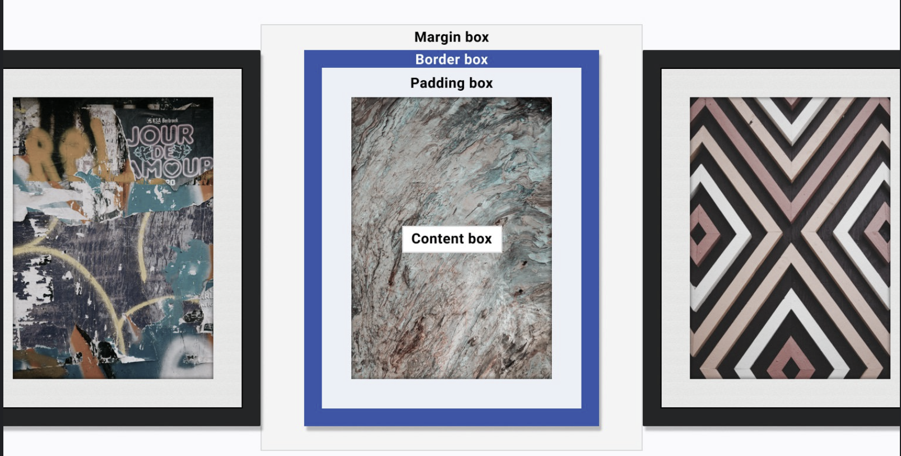

# CSS

## Relative Units

- % : relative to parent element
- em : relative to font size of the element or parent
- rem : relative to root element's font size
- vw : Viewport width
- vh : Viewport height
- vmin/vmax : Smaller/Larger of vw or vh

## Box Model

Everything displayed in CSS is a box.

- Content Box 
- Padding Box
- Border Box
- Outline and Box Shadow
- Margin Box

## Selectors

-   Universal         * (matches any element)
-   Type              div, p (matches a HTML element directly)
-   Class             .card (matches any element that has that class applied to)
-   ID                #main (An id attribute should be the only element on a page with that ID value)
-   Attribute         [type="text"]
-   Combinators       A > B, A + B
    -   (space) Descendant combinator 
    -   (>) Child combinator 
    -   (+) Next sibling combinator 
    -   (~) Subsequent-sibling combinator 
-   Pseudo-classes    a:hover, p:nth-child(even) (focus on specific platform state, like when an element is hovered, 
                        structures inside an element, or parts of an element.)
-   Pseudo-elements   ::before, ::after, ::marker
